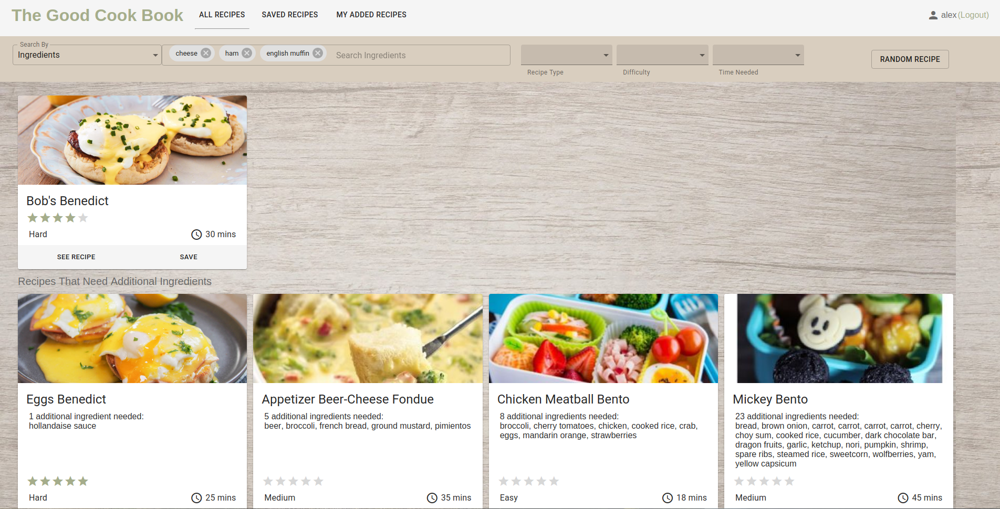

##CPSC436I PROJECT REPORT

**Project Name**: The Good Cook Book ([Heroku Link](https://thegoodcookbook.herokuapp.com))

**Group**: The Good Cook Book

**Team Members**:
- Jennifer Chen
- Ryan Knauer
- Kean Wah Wong

###Project Summary

The Good Cook Book is a recipe discovery app targeting anybody who cooks or wants to learn to cook.
 
Our web app provides users with recipes containing ingredients, ratings, cooking time, difficulty, and instructions. 
Users are able to find new recipes based on food categories, as well as add comments and ratings for recipes they like.

Our initial goals can be found in [the README.md](README.md) file. We are pleased to report that we have met all of the goals
that we set out to achieve at the inception of the project, including all of our stretch goals.

###Code Structure

[See STRUCTURE.md](STRUCTURE.md)
 
 ###Major components of the web application
 
 The Good Cook Book consists of the following major components:
 
 #### Front End Components (HTML/CSS, React/Redux)
 
 - **Home Page** - only accessible to logged in users. If the user has favourited recipes, a "Recommended for You" banner will pop up.
 Accessed when user clicks "The Good Cook Book", if they are logged in.
 

 - **Recipe Cards Listing** - shown when user selects one of "All Recipes", "Saved Recipes" and "My Added Recipes". 
 These tabs change the recipe cards filter to:
    - **All Recipes** - all recipes on website
    - **Saved Recipes** - recipes user has saved
    - **My Added Recipes** - recipes user has added to the website
    
There is a search/filter bar up top, that allows users to set filters and/or search recipes.

- **Search/Filter Bar** - Allows users to search/filter recipes. Filtering is done based on difficulty, meal type (breakfast, lunch, dinner, snack)
and time needed. Searching can be done based on name or ingredients. The ingredient search returns all recipes that
can be made with the provided ingredients.

- **Recipe Detailed View** - A detailed view of a recipe that shows up when the user clicks "See Recipe".
Opening a print dialog while the detailed view is open also shows the user a "printer friendly" version of the recipe.

- **Recipe Submission Form** - Only accessible to logged in users. Allows users to submit new recipes.

#### Backend/Server/Database (MongoDB, Node.js, Meteor)

- **Recommender system** - System that chooses what recipes to recommend to users based on their saved recipes. 
The recommender algorithm runs whenever a new recipe is added.

- **Backend searching system** - Provides the logic that allows the user to search the database, by adding filters and conditions to a Mongo query. Use of aggregations was necessary to implement the ingredient-based search.

- **Subscriptions/publications** - Meteor mechanism that limits the available information published to the client.

- **Collection methods** - Allows client-side to call database methods on the server side.

**Login/authentication system** - Standard Meteor authentication system with additional fields.

#### Individual Contributions

**Kean**

- Developed much of the scaffolding of the application, including building the data structures
used throughout the application. 
- Responsible for decisions related to application structure and standards.
 - Responsible for deployment, including moving the database and application to the cloud. 
    - Changed Redux to implement "loading" states
 - Created the "random recipe" button and recipe submission form.
 - Wrote the recommender system and algorithm.
 - Removed Meteor's default `autopublish` behaviour, and wrote the subscriptions/publications necessary for the app to function without `autopublish`.
 - **Initiative/Added Contribution**: Implemented an entire recommender system from scratch.
 
 **Jennifer**
 
 - Primary UX/UI designer.
 - Implemented the home page.
 - Responsible for the design and recipe cards functionality.
 - Created a common card used by the recipe's detailed view, registration, login and recipe submission form components.
 - Wrote the recipe detailed view component.
 - Removed Meteor's default `insecure` behaviour and wrote the Collection methods necessary for the application to function without `insecure`.
 - Created navigation bar tabs and added the "My Added Recipes" filter.
 - **Initiative/Added Contribution**: Showed mastery of CSS and React for UI/UX/front-end development.
 
 **Ryan**
 
 - Responsible for the app's search functionality, on both the front-end and back-end.
 - Implemented Search Bar with Material UI components.
 - Implemented back-end searching, necessitated by the fact that aggregations are only available as a server-side call in MongoDB.
 - Implemented pagination of recipe cards.
 - Abstracted Redux reducer for basic inputs
 - Implemeted various improvements to search functionality, including making ingredients search insensitive
 - **Initiative/Added Contribution**: Showed mastery of using MongoDB for aggregations in ingredient search
 
 ### Challenges faced by group
 
 #### UI/UX design challenges
 Designing the UI/UX was a major challenge for the group as we had built this application "feature-first" (with the model in mind)
 rather than design first. This made UI/UX design challenging, especially for our primary UX/UI designer, Jennifer, as we
 pushed out features, but there was very little cohesion in the design - it was difficult to find a way to put all the features
 on one page with an intuitive design.
 
 To remedy this, the group as a whole provided feedback to Jennifer on her UX/UI design choices, which improved as the project went by.
 We also solicited peer feedback through asking our friends to user test the application.
 
 In the end, through soliciting feedback from within our group and peers outside the group, we managed to come up with a website
 that was visually pleasing and provided for a good user experience - one of the most important aspects of website design.
 
 #### Search implementation challenges
 The group went through multiple iterations of agreeing over how the "Ingredient Search" function should work.
 
 We started off by implementing a simple subset search - that is, the app would return recipes that contained all of the
 a subset of the ingredients entered in the search bar. We then thought that this was confusing, so we had a discussions where
 we discussed whether the search function return recipes that only contained all of the ingredients listed, but eventually found that too limiting.
  
 Eventually, after two iterations, we settled on searching for the intersection count of searched ingredients and recipe ingredients using an aggregation. This was technically challenging for Ryan as he had to move all searching/filtering to the backend, as aggregation calls can only be
 made on MongoDB servers.
 
 This provided a good resolution to the problem, as it allowed users to not only see what recipes they could make with
 all the ingredients they had, but also what recipes are available to the user if the user bought a few more ingredients.
 
 ### Recommender system implementation challenges
 There were some challenges faced by the group in implementing the "Recommended for You" functionality.
 
 As the Recommender algorithm was developed from scratch, designing it was challenging. Determining the weights took up
 more time than anticipated, and resulted in some unintuitive results.
 
 As the weights were decided on (consisting of 70% ingredients similarity, 10% food type similarity, 20% cuisine similarity),
 there was the problem of determining how to calculate ingredient similarity with different-sized arrays. Initially, if the larger array contained
 the subset of all the ingredients in the smaller array, the two recipes would be counted as 100% similar, which
 seemed unintuitive.
 
 Some changes were made to the ingredients calculation step, where if the larger ingredient set was within
 two times the size of the smaller one, the percentage similarity would be based entirely on how many
 ingredients the larger set was missing; otherwise, the two scores (missing and hit ingredients) would be
 weighted. If the two sets were of the equal size, the algorithm would function as it used to.
 
 This provided for more accurate recommendations for users, which would contribute to a better user experience.
 
 ### Future enhancements
 
 The following improvements could be considered to make the app a better one:
 
 
**UI/UX improvements**

There are still some improvements that could be made to the UI/UX of the web application. For example, some features are still
rather hidden. To add a new recipe, one has to first navigate to the "My Added Recipes" tab, which might not be intuitive to some users.

**Searching improvements**

It is possible that we could improve the search functionality of our app by implementing the following:

- Allow users to not only search the website for recipes, but to search the web for recipes satisfying their criteria.
- Use a NLP to expand ingredient search (for example, searching "auburgine" and "eggplant" would result in returning both recipes that had "auburgine" and "eggplant" in them)

**Recommender system improvements**

In its current form, the recommender system could use some improvement.

- Add the text of the recipe as a component in determining similarity. This could be aided by NLP to determine how similar two recipe names are.
- Make the cuisine component of the recommender smarter - it is currently a 1:1 match, so if a recipe is listed as
Canadian cuisine, when compared to a recipe that is listed as American cuisine, it would return 0% similarity, which doesn't seem right.